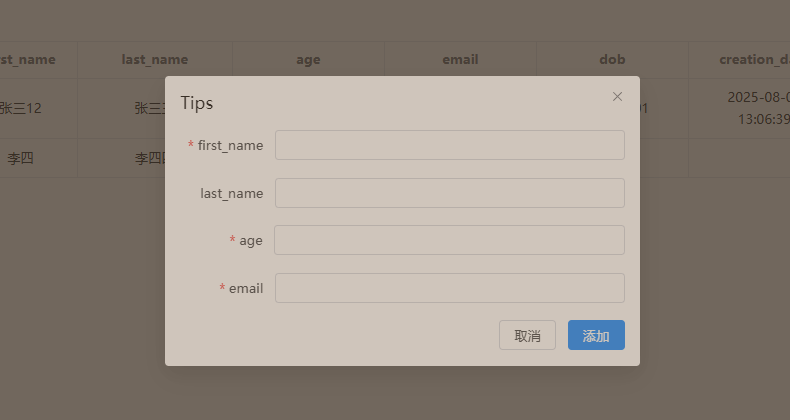

# 测试系统

基于Laravel框架构建的用户管理系统，包含用户认证、用户管理。

## 功能特性

- ✅ 用户登录认证（Token）
- ✅ 用户信息CRUD操作
- ✅ 分页查询（支持关键词搜索）
- ✅ RESTful API
- ✅ 单元测试

## 技术栈

- **后端**: PHP 8.2.9+ / Laravel 12+
- **前端**: Vue 3 / Element Plus 、node.js 20+
- **数据库**: MySQL 5.7.0+
- **缓存**: Redis
- **API文档**: apidoc

## 推荐环境

phpstudypro 集成php、mysql、redis等各种软件

## 安装指南

### 安装phpstudypro

参考 https://blog.csdn.net/fq157856469/article/details/133706706

### 安装相关环境

```
git clone后cd到项目目录
composer install 
npm install npm
npm run dev 

```

## 项目相关

### 系统结构

后端

![(images/README/1754100033407.png)

前端


### 项目Api

项目Api根据apidoc自动生成。地址为localxxxx/apidoc。


### 项目单元

项目测试使用laravel的测试框架。测试文件在tests目录下。
运行测试命令：

```
vendor/bin/phpunit
```

### 项目登录

以本文为例，登录地址为http://localhost:8085/#/login，登录成功后跳转到http://localhost:8085/#/list


```账号默认：admin
账号默认：admin
密码默认：123456
```

### 用户列表


由于数据有限为了展示分页，后端以两条数据为分页。

### 用户新增

以弹窗的形式新增数据。



### 用户编辑


### 删除数据

点击确定后删除


